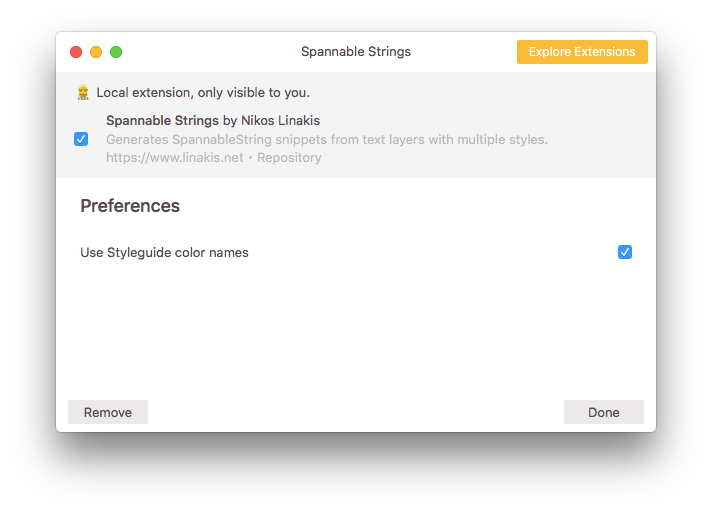
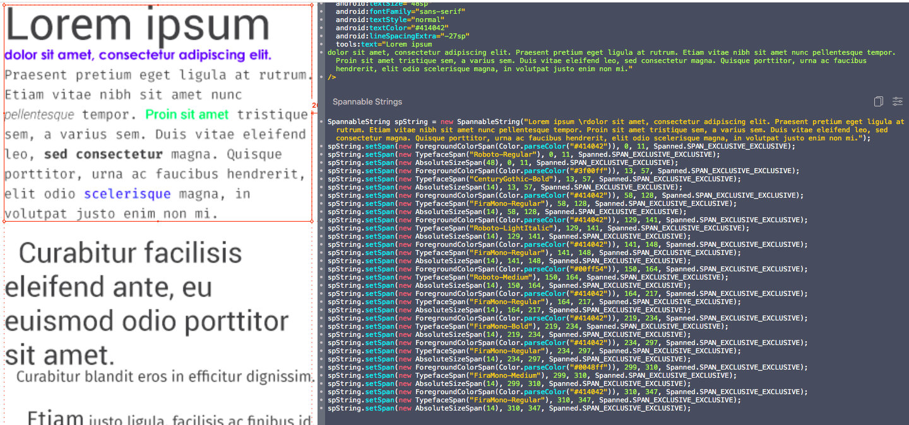

# zeplin-extension-spannablestring

Generates SpannableString snippets from text layers with multiple styles.

  

A sample output would like the following

  

## How to Install
Checkout latest code and follow the instruction from official [tutorial](https://github.com/zeplin/zeplin-extension-documentation/blob/master/tutorial.md#adding-a-local-extension).
